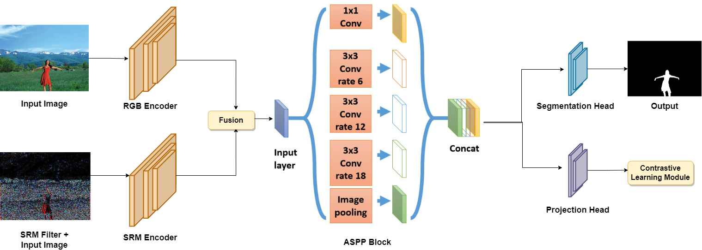

# CFL-Net: Image Forgery Localization Using Contrastive Learning



This is the official implementation of WACV-2023 paper by Fahim Faisal Niloy,Kishor Kumar Bhaumik,and Simon S. Woo \
[CFL-Net: Image Forgery Localization Using Contrastive Learning](https://openaccess.thecvf.com/content/WACV2023/papers/Niloy_CFL-Net_Image_Forgery_Localization_Using_Contrastive_Learning_WACV_2023_paper.pdf).


Setup: Run

  ```shell
  pip install -r requirements.txt
  ```

Step 1: Download IMD-20 Real Life Manipulated Images from [Link](http://staff.utia.cas.cz/novozada/db/).

step2: set the dataset path in  

for example, if you have downloaded and unzipped the IMD2020 dataset in the following directory: ``` /home/forgery/ ```  then put  ``` /home/forgery/ ```  as the base_dir  in the config file. (DO NOT put  ``` /home/forgery/IMD2020/ ``` in base_dir )

Step 3: To train the model run   
  ```shell
  python trainer.py
  ```
Step 4: To test the model run   
  ```shell
  python evaluate.py
  ```

Please Cite Our paper using:
  ```shell
@inproceedings{niloy2023cfl,
  title={CFL-Net: image forgery localization using contrastive learning},
  author={Niloy, Fahim Faisal and Bhaumik, Kishor Kumar and Woo, Simon S},
  booktitle={Proceedings of the IEEE/CVF Winter Conference on Applications of Computer Vision},
  pages={4642--4651},
  year={2023}}
  ```
